# Zeta2 Bringup Pakage

# STEP

## 1. 라즈베리파이에 우분투 22.04 OS 설치

https://www.raspberrypi.com/software/

1. 위 사이트에서 Raspberry Pi Imager를 자신의 환경에 맞게 다운로드 받는다.

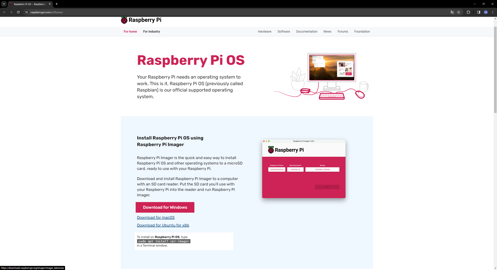

2. 장치선택에서 Raspberry Pi 4 선택

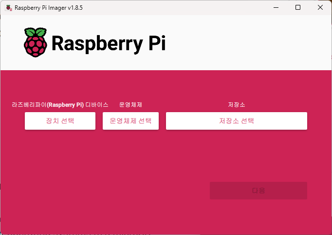

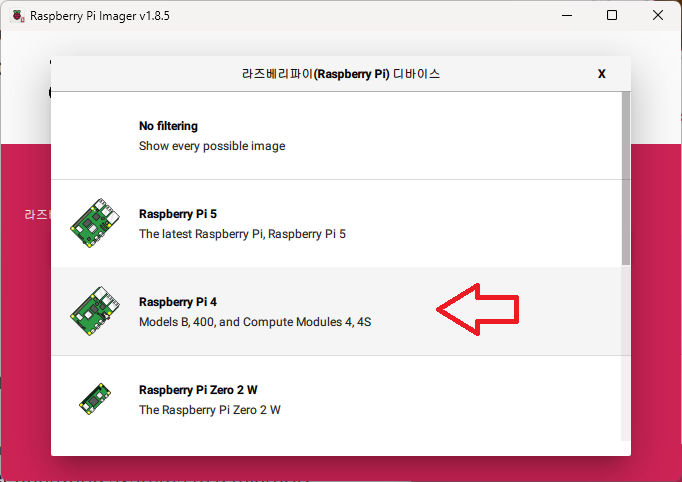


3. 운영체제 선택에서 Other general-purpose OS -> Ubuntu -> 22.04 (64-bit)

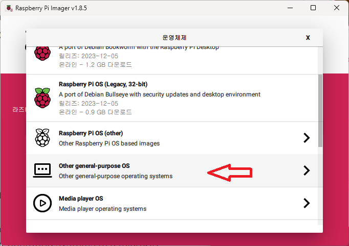

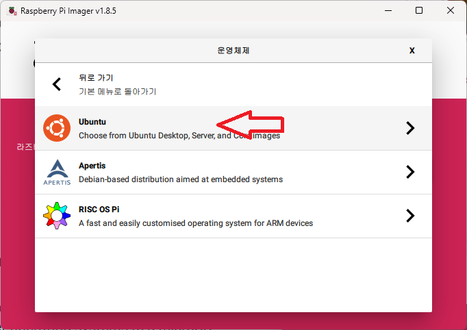

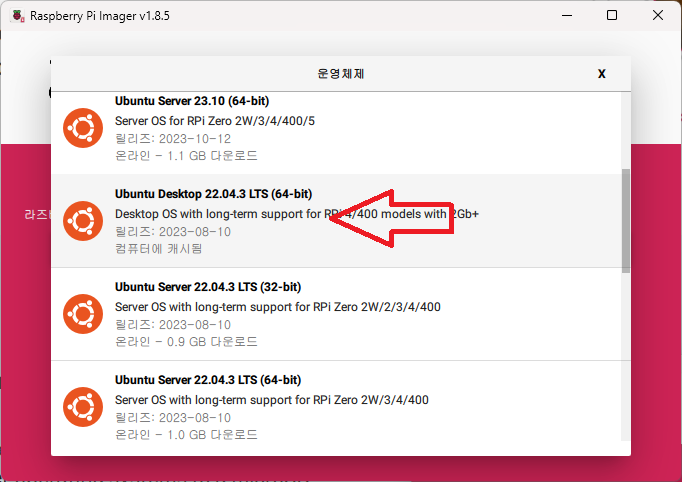

4. 저장소 선택에서 현재 사용하기 위해 연결한 SD 카드 선택

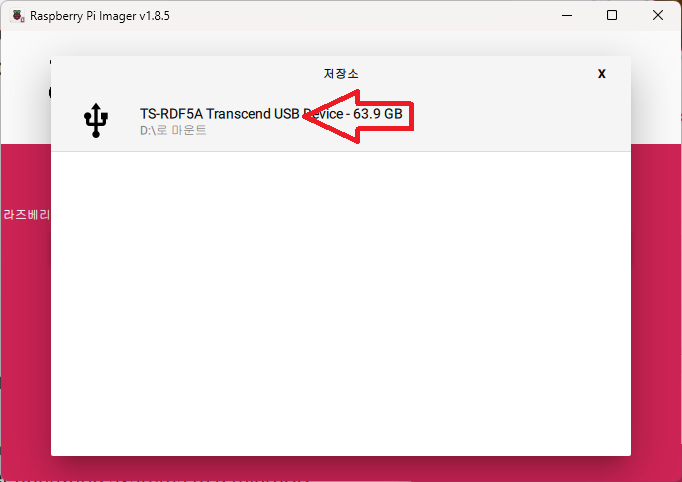

5. 다음 -> 예 -> 완료

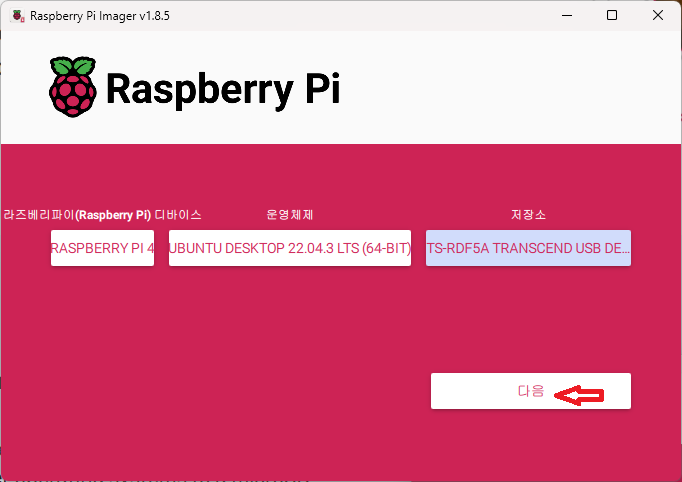
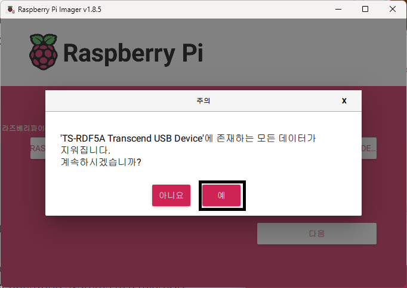
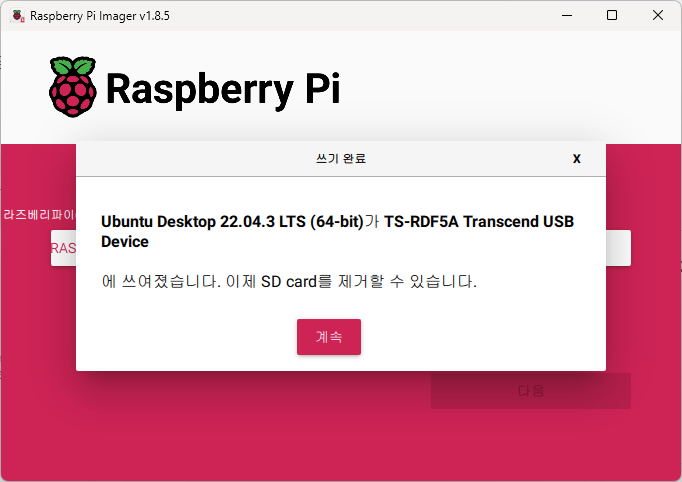

## 2. 라즈베리 파이 자체 WIFI 구성하기

1. OS가 설치된 SD카드를 라즈베리파이에 꼽고 LAN 선을 연결한다.

2. 라즈베리파이의 WIFI 이름은 이더넷 맥 어드레스 뒤의 4개로 한다.

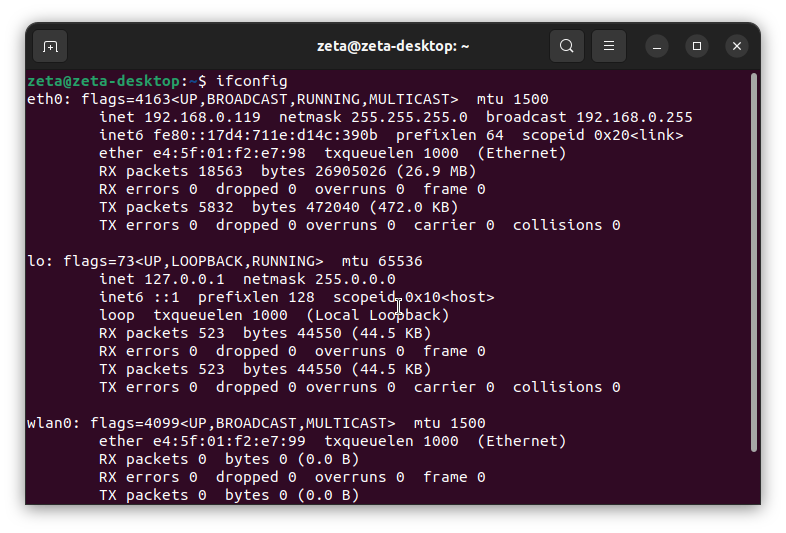

```bash
sudo apt update
sudo apt install net-tools
zeta@zeta-desktop:~$ ifconfig
eth0: flags=4163<UP,BROADCAST,RUNNING,MULTICAST>  mtu 1500
        inet 192.168.0.119  netmask 255.255.255.0  broadcast 192.168.0.255
        inet6 fe80::17d4:711e:d14c:390b  prefixlen 64  scopeid 0x20<link>
        ether e4:5f:01:f2:'e7:98'  txqueuelen 1000  (Ethernet)
        RX packets 23653  bytes 28893076 (28.8 MB)
        RX errors 0  dropped 0  overruns 0  frame 0
        TX packets 16292  bytes 13972500 (13.9 MB)
        TX errors 0  dropped 0 overruns 0  carrier 0  collisions 0

lo: flags=73<UP,LOOPBACK,RUNNING>  mtu 65536
        inet 127.0.0.1  netmask 255.0.0.0
        inet6 ::1  prefixlen 128  scopeid 0x10<host>
        loop  txqueuelen 1000  (Local Loopback)
        RX packets 595  bytes 54723 (54.7 KB)
        RX errors 0  dropped 0  overruns 0  frame 0
        TX packets 595  bytes 54723 (54.7 KB)
        TX errors 0  dropped 0 overruns 0  carrier 0  collisions 0

wlan0: flags=4163<UP,BROADCAST,RUNNING,MULTICAST>  mtu 1500
        inet 10.42.0.1  netmask 255.255.255.0  broadcast 10.42.0.255
        inet6 fe80::eb54:a26d:6e0e:514e  prefixlen 64  scopeid 0x20<link>
        ether e4:5f:01:f2:e7:99  txqueuelen 1000  (Ethernet)
        RX packets 0  bytes 0 (0.0 B)
        RX errors 0  dropped 0  overruns 0  frame 0
        TX packets 50  bytes 5259 (5.2 KB)
        TX errors 0  dropped 0 overruns 0  carrier 0  collisions 0


sudo apt install openssh-server
```

3. 바탕화면에서 우측 상단 클릭

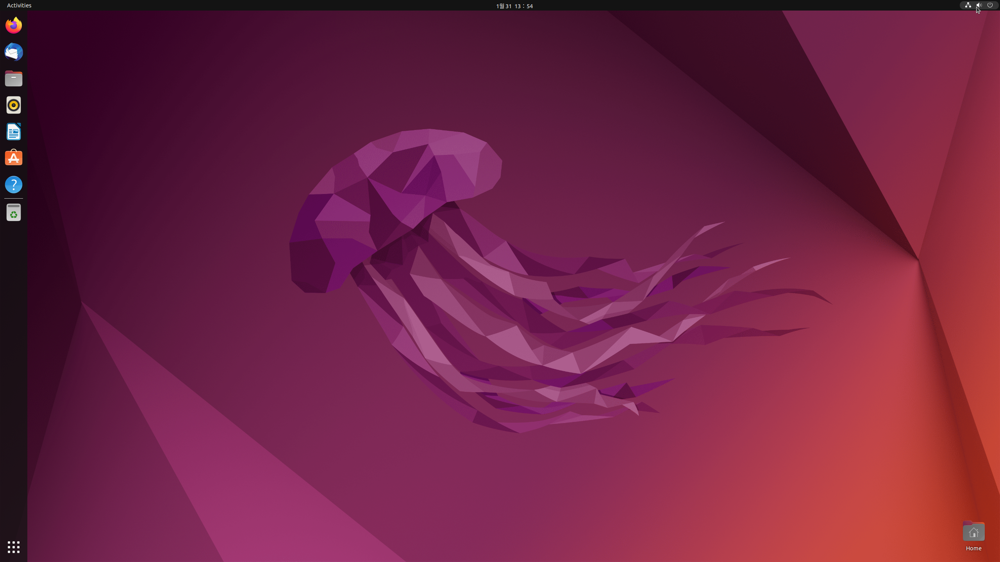

4. 'WiFi-Not Connected'

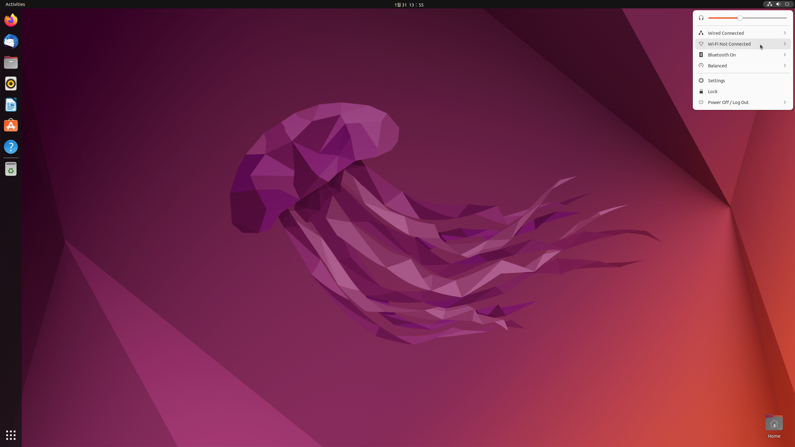

5. 'Wi-Fi Settings'

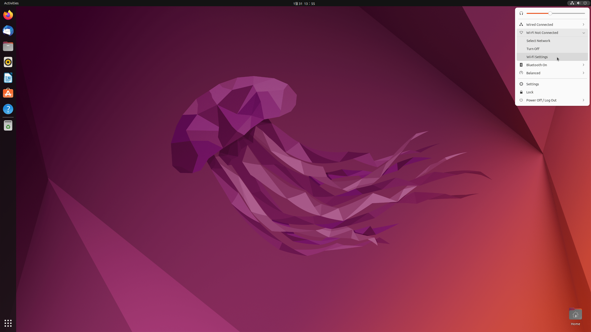


6. 점 세개

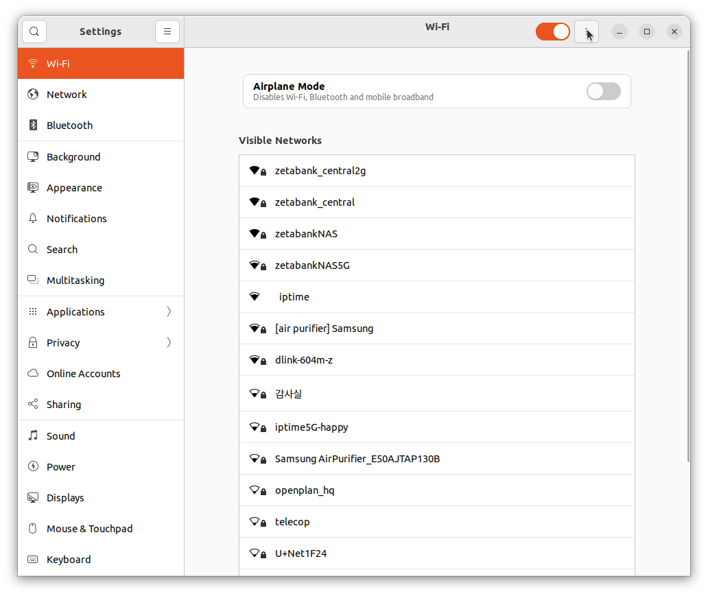

7. Turn On Wi-Fi Hotspot...'

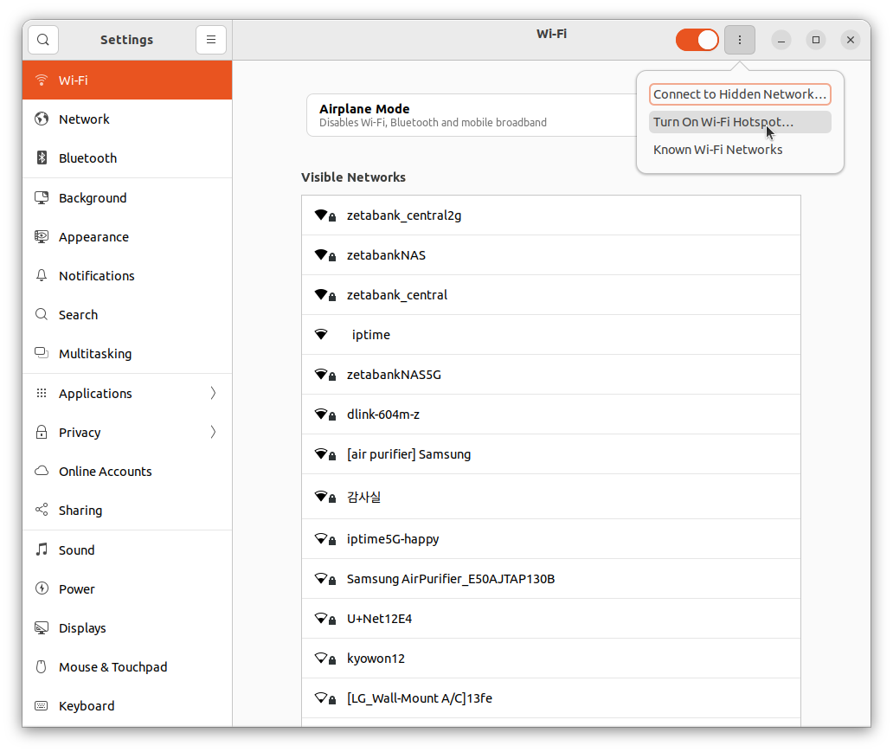

8. Network Name: zeta2_e798 \
    Password: 12345678
9. Turn On

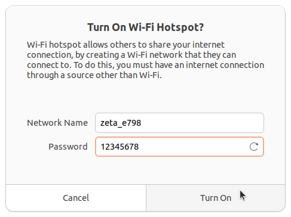


10. sudo -H gedit /etc/NetworkManager/system-connections/Hotspot.nmconnection \
    autoconnect=false -> autoconnect=true


## history

- https://docs.ros.org/en/humble/Installation/Ubuntu-Install-Debians.html
```bash
sudo apt install ros-humble-desktop
```

## ld06lidar setting
- https://forums.raspberrypi.com/viewtopic.php?t=307094
```bash
sudo apt update
sudo apt install raspi-config
sudo raspi-config
Interface Options
Serial Port
YES or NO to "Would you like a login shell to be accessible over serial?"
NO
YES
"The serial login shell is enabled, The serial interface is enabled"
```
```bash
ls /dev/ttyS0
# sudo cp ~/zeta_ws/src/zeta2_edu_source/sensor/ldlidar-ros2/99-ldlidar.rules /etc/udev/rules.d/
sudo usermod -a -G tty $USER
sudo usermod -a -G dialout $USER
reboot
```

## build

```bash
# bringup
sudo apt install ros-humble-tf-transformations -y
sudo apt install python3-pip -y
sudo pip3 install transforms3d 
sudo apt install ros-humble-robot-localization -y


# description
sudo apt install ros-humble-joint-state-publisher-gui -y
sudo apt install ros-humble-xacro -y
```

```bash
echo "source /opt/ros/humble/setup.bash" >> ~/.bashrc
source ~/.bashrc

mkdir -p ~/zeta_ws/src
cd ~/zeta_ws/src
git clone https://github.com/zetabank-devteam/zeta2_edu_devel.git
```

```bash
cd ~/zeta_ws

colcon build
echo "source ~/zeta_ws/install/setup.bash" >> ~/.bashrc
source ~/.bashrc


# ros2 launch zeta2_bringup zeta_if.launch.py # interface board -> imu, sonar
# ros2 launch zeta2_bringup zeta_mc.launch.py # motor board -> motor
# ros2 launch zeta2_bringup control.launch.py # input motor
# ros2 launch zeta2_bringup odometry.launch.py # odom
# ros2 launch zeta2_bringup zeta2_state_publisher.launch.py # making tf
# ros2 launch ldlidar ldlidar.launch.py serial_port:=/dev/ttyS0 lidar_frame:=base_scan # scan

ros2 launch zeta2_bringup zeta2_bringup.launch.py # if, mc, control, odom

ros2 launch zeta2_bringup zeta_joy.launch.py
```
